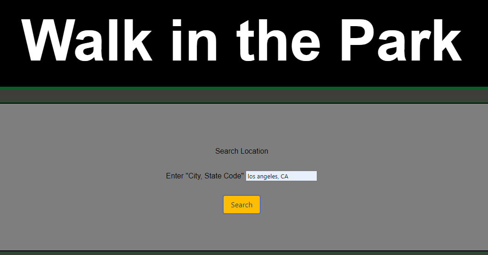

# Walk in the Park

 ## Table of contents
* [Installation](#installation)
* [Usage](#usage)
* [Credits](#credits)
* [License](#license)

---
## Description

  Have you ever struggled with finding a fun day activity for the family? Well our application Walk in the Park has the fix for you. All the user needs to do is input a city and state and then Walk in the Park will provide you with parks local to the area and the weather for the next 5 days in that city!

## Installation
  No installation is required. This is a web based application

## Usage
  All the user needs to do is enter a city and state code of thier choice and hit the submit button, then they will be presented with local parks and the weather for the next 5 days. 

  ---

## Credits
  Haniel Chang https://github.com/hanielchang, Daniel Snowden https://github.com/snowden421, MinhHa Pham https://github.com/minhhap, and Kyle Kilmartin (myself)

  ### Have any questions or concerns? Contact me!
https://github.com/KyleKilmartin371/group-project

kylekilmartin371@gmail.com

  ---
### License
  https://opensource.org/licenses/MIT

